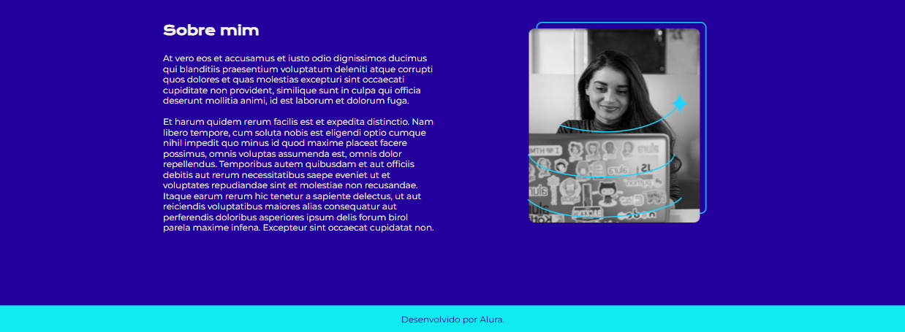

 
# *Projeto na prática: Portfólio Joana Santos* 
>## HTML e CSS
>- Ambientes de desenvolvimento, estrutura de arquivos e tags
>- Classes, posicionamento e Flexbox
>- Cabeçalho, footer e variáveis CSS
>- Trabalhando com responsividade e publicação de projetos
> #### Nestes curso mergulhei de cabeça nas linguagens de *HTML e CSS*, desenvolvi diversas habilidades novas e conclui este belo projeto de portfólio digital.

